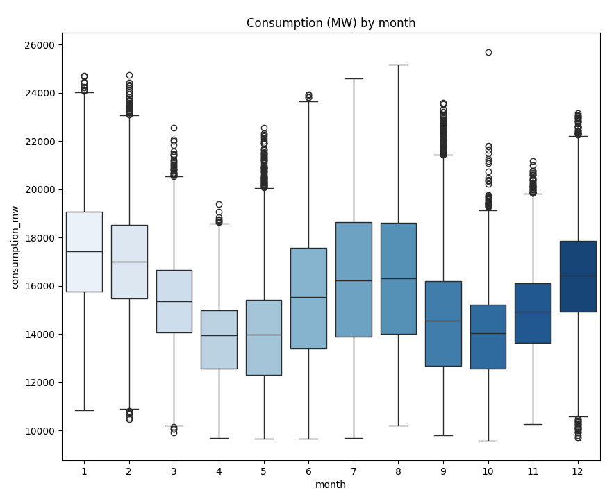
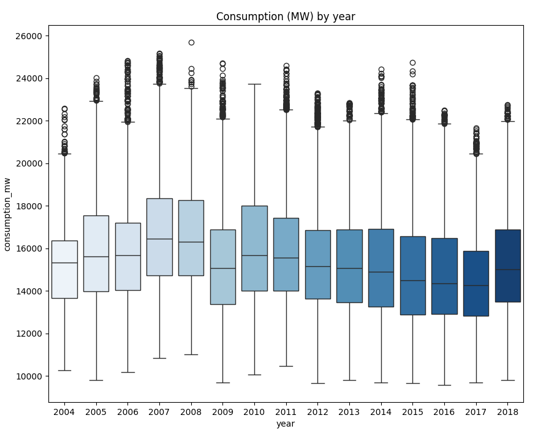
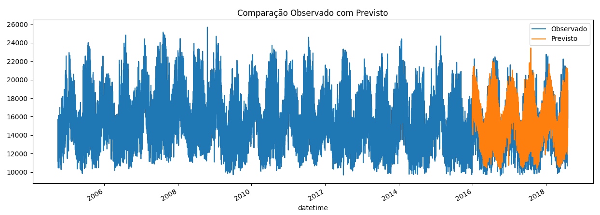
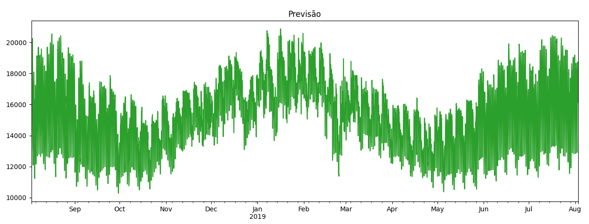

# Kaggle_Dataset_Forecast

Repositório para um modelo simples de previsão sobre gasto de energia com python utilizando XGBoost.

Os dados utilizados para a construção deste modelo presentes no arquivo "kaggle.csv" podem ser encontrados neste <a href=https://www.kaggle.com/datasets/robikscube/hourly-energy-consumption>link<a>.

Neste link, é possível encontrar o consumo por hora de energia registrado pelas empresas americanas de energia como "FirstEnergy" ou "Northern Illinois Hub". O csv utilizado neste modelo foi o consumo registrado pela empresa American Electric Power (AEP).

---
## Dataset

No kaggle.csv, temos o registro do consumo horário de energia da __AEP__ do dia 31-12-2004 até 01-01-2018. A estrutura dos dados se encontra da seguinte forma:

| Column | Description | Datatype |
| ------ | ----------- | -------- |
| Datetime | Marca o dia e hora do registro do consumo | string |
| AEP_MW | Consumo em megawatts (MW) | float |

---

## Modelo de previsão

Para a criação deste modelo de previsão, precisamos definir antes qual será o valor a ser previsto. Dado que __Datetime__ é o campo que define a série como temporal, não faz muito sentido utilizar ela.

Já o campo de consumo, como são dados de uma empresa de distribuição, faz sentido prever o consumo para evitar problemas com a produção e distribuição de energia.

### Extração e limpeza

Com o objetivo da previsão definido, realizamos a extração e limpeza dos dados com o seguinte código:

```python
import pandas as pd
import numpy as np
from datetime import date, timedelta

# Realiza a extração
dataframe = pd.read_csv('kaggle.csv')

# Renomeia as colunas para padronização
dataframe.columns = ['datetime', 'consumption_mw']

# Dado que o tipo da coluna "datetime" chega como string, alteramos para o datatype certo
dataframe['datetime'] = pd.to_datetime(dataframe.datetime)

# Organiza por datahora
dataframe = dataframe.sort_values(by='datetime')

# Remove valores nulos e duplicados
dataframe = dataframe.dropna() # removes null values
dataframe = dataframe.drop_duplicates(subset='datetime')
```

Dado a extração, como os registros são horários, realizo uma checagem rápida para conferir se existe algum passo maior que 1 hora entre os registros.

```python
dataframe['time_interval'] = dataframe.datetime - dataframe.datetime.shift(1)
```

Como o maior passo encontrado foi de 2 horas, com apenas 27 ocorrências, decidi replicar o valor do consumo registra na hora anterior para a hora faltante, permitindo que o treinamento do modelo seja realizado com os passos de tempo iguais.

```python
missing_df = dataframe.loc[dataframe.time_interval == timedelta(hours=2)]
missing_df['datetime'] = missing_df['datetime'] + timedelta(hours=1)
dataframe = pd.concat([dataframe, missing_df])
dataframe = dataframe.drop('time_interval', axis=1)
dataframe = dataframe.sort_values(by='datetime')
```

### Features

Depois de extraiz e realizar uma limpeza nos dados, começo a analisar as qualidades presente nos dados que afetam o consumo de energia.

Por termos apenas o campo de datahora, utilizo desse campo para a criação de mais campos como mês, hora ou dia da semana para encontrar padrões no consumo de energia com a função __date_feature__.

```python
def date_feature(df):
    df = df.copy()
    df['hour'] = df.index.hour
    df['dayofweek'] = df.index.dayofweek
    df['quarter'] = df.index.quarter
    df['month'] = df.index.month
    df['dayofyear'] = df.index.dayofyear
    df['day'] = df.index.day
    return df

dataframe = dataframe.set_index('datetime')
dataframe = date_feature(dataframe)
```

Essas datas foram definidas ao conferir em gráficos boxplot do consumo sobre as métricas de tempo, explorando a variância deles. Por exemplo, ao ver o consumo por mês, é possível ver que durante o verão e inverno, provavelmente pelo uso de ar condicionado ou aquecedor, existe um gasto maior de energia se comparado ao outono e primavera.



> Gerado com seaborn e matplotlib

Entretanto, ao conferir o gasto por ano, eles não apresentam nenhuma correlação.



> Gerado com seaborn e matplotlib

Um ponto sobre métricas de tempo como hora e semana, é que eles são cíclicos, ou seja, se a hora começa com 0, ele cresce até chegar em 23, e depois disso se torna 0 novamente, o que facilita a existência de hábitos e padrões.

Outra categoria que adicionei também foi o atraso onde eu registro o consumo de uma ano anterior a data registrada, permitindo que o modelo observe o consumo do mesmo dia no ano anterior.

```python
def add_lags(df):
    target_map = df['consumption_mw'].to_dict()
    df['year_lag'] = (df.index - pd.Timedelta('365 days')).map(target_map)
    return df

dataframe = add_lags(dataframe)
```

### Treinando o modelo

Após termos as categorias definidas e calculadas para a previsão, separamos os dados em duas parte, uma que servirá para treinarmos o modelo de previsão, e outra para testarmos o modelo.

Para estes dados, separei os dois últimos anos para serem utilizados no teste, e o resto para o treinamento.

```python
traindf = dataframe.loc[dataframe.index < '01-01-2016']
testdf = dataframe.loc[dataframe.index >= '01-01-2016']
```

Com isso, agrupo as colunas que serão utilizadas para definir o consumo de energia em uma variável "__x__" para o dataframe de treino e teste, e o alvo, o consumo de energia, para uma variável "__y__".

```python
target = 'consumption_mw'
feature = [feature for feature in dataframe.columns if feature not in target]

X_train = traindf[feature]
y_train = traindf[target]

X_test = testdf[feature]
y_test = testdf[target]
```

Com os dataframes de teste e treinos prontos, inicializo o __XGBRegressor__ da biblioteca __XGBoost__. O XGBRegressor é utilizado para uma análise de regressão, ou seja, ele vai observar os valores das categorias e alvo, e definir uma função que se aproxima com os dados do dataframe de treinamento.

```python
import xgboost as xgb

# Inicializa o modelo
reg = xgb.XGBRegressor()

# Treina o modelo
reg.fit(X_train, y_train)

# Realiza a previsão sobre os dados teste
testdf['pred'] = reg.predict(X_test)
```

Após a inicialização do XGBoost e treino do modelo, fazemos uma comparação com os dados de teste ao calcular o __Erro Quadrático Médio__, ou RMSE. O RMSE é basicamente uma medida sobre o desvio padrão dos 

O cálculo para encontrarmos o RMSE é realizando uma somatória da diferença entre os valores previstos com os valores observados elevado ao quadrado, dividido pelo número de valores observados. Depois disso, tiramos a raiz quadrada para chegar no RMSE.

$$RMSE = \sqrt{\frac{1}{n}\sum_{i=1}^{n}{({ŷ_i - y_i})^2}}$$

```python
rmse_score = np.sqrt(mean_squared_error(testdf['consumption_mw'], testdf['pred']))
```

Dessa forma, quanto maior o valor, mais distante o modelo previsto está dos valores reais, ou seja, quanto menor o valor, mais perto a previsão vai estar do valor real.

Algumas formas de diminuirmos o valor de RMSE seria por ajustes nos dados, como nas limpezas e preparação dos dados que fizemos antes, ou ajustes na análise de regressão. Como neste modelo estamos usando o __XGBoost__, o ajuste da análise de regressão deve ser feita com base de seus parâmetros, que podem ser encontrados em sua <a href="https://xgboost.readthedocs.io/en/stable/parameter.html">documentação</a>

Para este modelo, segui com esses parâmetros abaixo, chegando a uma pontuação RMSE ao redor de 1800.

```python
reg = xgb.XGBRegressor(
    learning_rate=0.1,
    max_depth = 8
)
```

Por fim, crio uma visualização para observar a comparação do modelo previsto com o observado.

```python
import matplotlib.pyplot as plt

dataframe = dataframe.merge(testdf[['pred']], how='left', left_index=True, right_index=True)
ax = dataframe[target].plot(figsize=(15, 5))
dataframe['pred'].plot(ax=ax)
plt.legend(['Observado', 'Previsto'])
ax.set_title('Comparação Observado com Previsto')
plt.show()
```



### Prevendo o futuro

Com o modelo de regressão e tratamento dos dados realizado, retreinamos o modelo com todos os dados do kaggle.csv par realizarmos a previsão do ano seguinte aos dados oferecidos.

```python
reg.fit(dataframe[feature], dataframe[target])
```

Com o modelo treinado, definimos o alcance da previsão, neste caso, da última data dos dados até o ano seguinte.

```python
# Adiciona anos na data, enquanto verifica por anos bissextos
def add_years(d, years):
    try:
        return d.replace(year = d.year + years)
    except ValueError:
        return d + (date(d.year + years, 1, 1) - date(d.year, 1, 1))

last_date = dataframe.index.max()
next_year = add_years(dataframe.index.max(), 1)
```

Então, criamos um dataframe com as novas datas, e adicionamos as novas datas sobre o dataframe original para utilizarmos os dados de consumo do ano anterior (year_lag).

```python
# Cria um dataframe para previsão
forecast_range = pd.date_range(last_date, next_year, freq='1h')
forecast_df = pd.DataFrame(index=forecast_range)
forecast_df['for_forecast'] = True
dataframe['for_forecast'] = False

# Concatena os dataframes dos dados tratados com o de previsão
concat_df = pd.concat([dataframe, forecast_df])

# Adiciona características de data e atraso de um ano 
concat_df = date_feature(concat_df)
concat_df = add_lags(concat_df)

# Pega apenas as datas onde iremos realizar a previsão
forecast_df = concat_df.query('for_forecast').copy()
```

Com isso, realizamos a previsão com a função __predict()__, e criamos uma visualização.

```python
forecast_df['pred'] = reg.predict(forecast_df[feature])
forecast_df['pred'].plot(
    figsize=(15,5),
    color=color_pal[2],
    title='Previsão'
)
plt.show()
```

